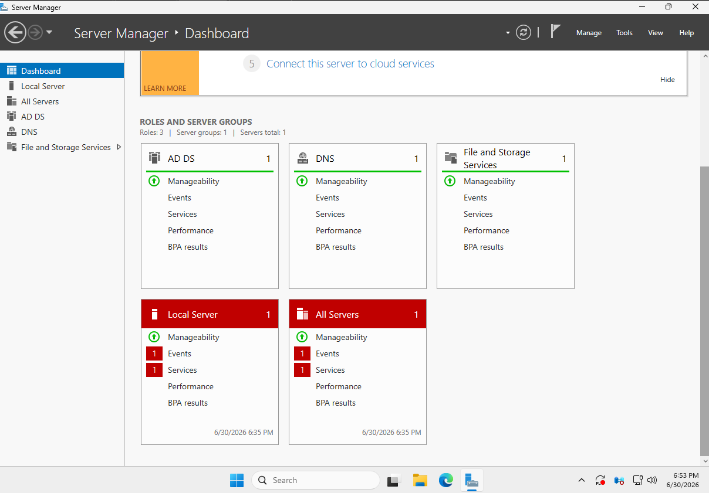
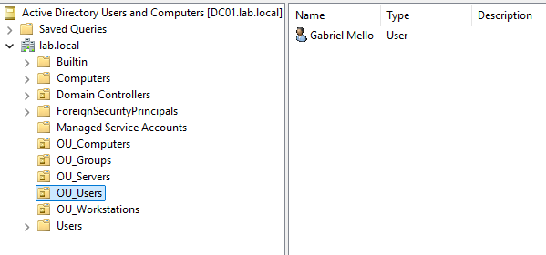
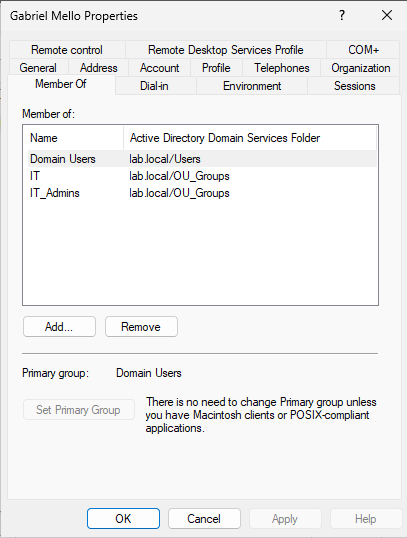
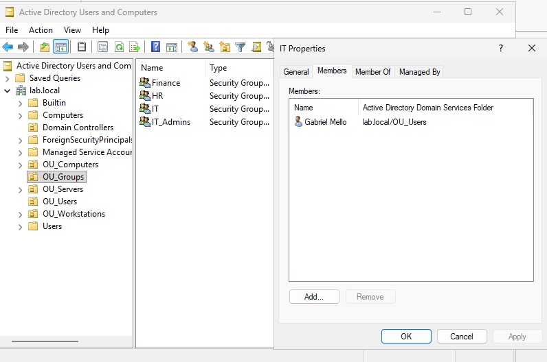
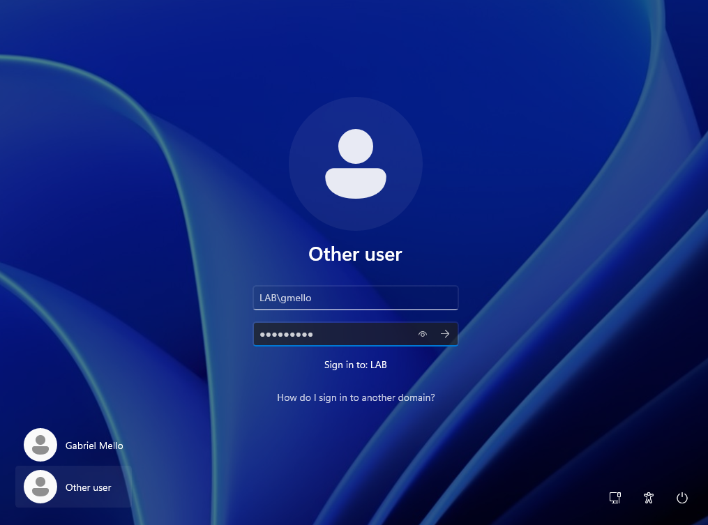
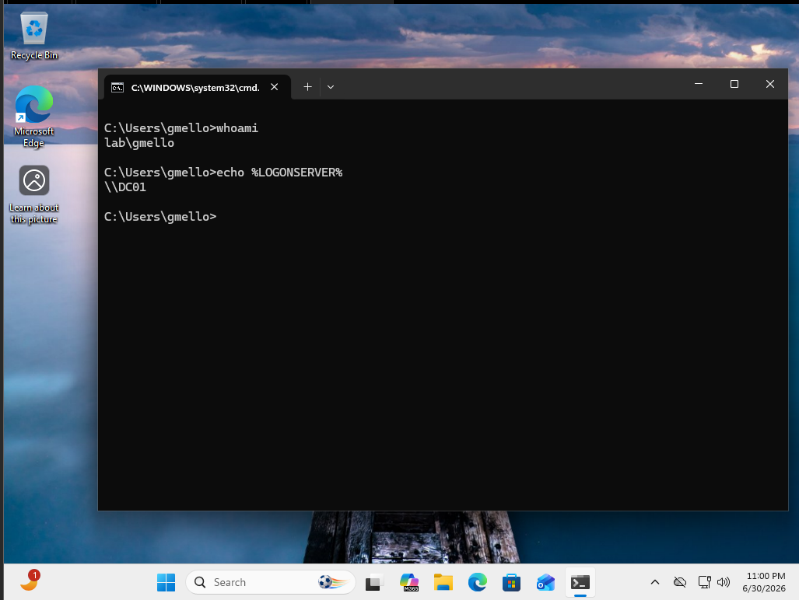

# 01 - Active Directory Domain Services

**Status:** Completed  
**Domain:** `lab.local`  
**Virtualization platform:** VMware Workstation

## Overview

This project documents the deployment of a small Windows domain environment using VMware Workstation.

A Windows Server 2025 virtual machine named `DC01` was promoted to the first domain controller of the `lab.local` forest. A Windows 11 workstation named `WIN11-01` was then joined to the domain, allowing users to authenticate through Active Directory instead of relying only on local accounts.

The environment was also organized with Organizational Units, domain users, and security groups to prepare it for later File Server and Group Policy projects.

---

## Lab Environment

| Machine | Operating System | IP Address | Purpose |
|---|---|---:|---|
| DC01 | Windows Server 2025 | `192.168.222.20` | Domain Controller and DNS Server |
| WIN11-01 | Windows 11 Pro | `192.168.222.30` | Domain-joined workstation |

Both machines were configured on the same VMware virtual network.

---

## Objectives

- Install Active Directory Domain Services.
- Promote `DC01` to a domain controller.
- Create the `lab.local` forest and domain.
- Create an Organizational Unit structure.
- Create a domain user and departmental security groups.
- Join `WIN11-01` to the domain.
- Authenticate on the workstation using a domain account.
- Validate domain membership and centralized authentication.
- Prepare the environment for File Server and Group Policy administration.

---

## Implementation

### 1. Installed the required server roles

The following Windows Server roles were installed on `DC01`:

- Active Directory Domain Services
- DNS Server
- File and Storage Services

Active Directory Domain Services provides centralized identity and authentication management. DNS was installed because Active Directory depends on name resolution to locate domain controllers and other domain services.



---

### 2. Promoted DC01 to a domain controller

After installing Active Directory Domain Services, `DC01` was promoted to the first domain controller in a new forest.

The domain created for the lab was:

```text
lab.local
```

After the promotion process, the server became responsible for authenticating domain accounts and managing the Active Directory database.

---

### 3. Created the Organizational Unit structure

Custom Organizational Units were created to separate directory objects by type and make the environment easier to administer.

```text
lab.local
├── OU_Computers
├── OU_Groups
├── OU_Servers
├── OU_Users
└── OU_Workstations
```

The intended purpose of each OU is:

- `OU_Computers` — General or unclassified computer accounts.
- `OU_Groups` — Security groups used for permissions and administration.
- `OU_Servers` — Server computer accounts.
- `OU_Users` — Domain user accounts.
- `OU_Workstations` — Employee workstation accounts.

This structure also prepares the environment for targeted Group Policy configuration and future expansion.



---

### 4. Created a domain user

The domain user `gmello`, representing Gabriel Mello, was created inside `OU_Users`.

The account was assigned to the appropriate security group based on its role in the IT department.



---

### 5. Created security groups

The following security groups were created inside `OU_Groups`:

- `Finance`
- `HR`
- `IT`
- `IT_Admins`

These groups make it possible to assign permissions according to job function instead of configuring permissions separately for every user.

The groups are later used to control access to departmental shared folders and administrative resources.



---

### 6. Joined WIN11-01 to the domain

Before joining the domain, `WIN11-01` was configured to use `DC01` at `192.168.222.20` as its DNS server.

The workstation was then joined to:

```text
lab.local
```

After restarting the workstation, the domain account was available on the Windows sign-in screen.



---

## Validation

The configuration was validated by signing in to `WIN11-01` using the `gmello` domain account.

The following command was executed from the workstation:

```cmd
whoami
```

The result identified the authenticated account as:

```text
lab\gmello
```

This confirmed that the session was authenticated by the `lab.local` domain rather than by a local Windows account.



Additional checks performed during the lab included:

- Confirming that `WIN11-01` appeared as a domain computer.
- Confirming that the user account appeared inside `OU_Users`.
- Confirming that the user had the expected security-group membership.
- Confirming that the workstation used `192.168.222.20` as its DNS server.
- Confirming name resolution between the workstation and `DC01`.

---

## Troubleshooting and Important Observations

### The workstation must use the domain controller for DNS

A domain client must use the internal DNS server hosted on `DC01`. Public DNS services such as Google DNS or Cloudflare DNS do not contain the private records for `lab.local`.

The workstation was therefore configured to use:

```text
192.168.222.20
```

as its DNS server.

This allows the client to locate the domain controller and access Active Directory services correctly.

### Organizational Units and security groups serve different purposes

During the project, two different methods of organizing objects were used:

- Organizational Units organize Active Directory objects and allow policies or administrative delegation to be targeted.
- Security groups are used to assign access and permissions to users collectively.

A user can be stored inside one OU while also belonging to several security groups.

---

## Lessons Learned

- Active Directory provides centralized authentication and directory management.
- DNS is a critical dependency of Active Directory.
- Domain clients should use the domain controller as their DNS server.
- Organizational Units and security groups solve different administrative problems.
- Permissions should be assigned to groups rather than directly to individual users whenever possible.
- A successful configuration should be validated from the client workstation, not only from the server.
- Clear naming and object organization make an environment easier to manage as it grows.

---

## Skills Demonstrated

- VMware Workstation administration
- Windows Server 2025 administration
- Active Directory Domain Services deployment
- Domain-controller promotion
- Active Directory forest and domain creation
- Organizational Unit design
- Domain-user administration
- Security-group administration
- Windows domain join
- DNS dependency configuration
- Domain authentication validation
- Basic command-line troubleshooting
- Technical documentation

---

## Next Project

The next stage of the lab is the deployment of a centralized File Server using:

- Departmental shared folders
- NTFS permissions
- Share permissions
- Active Directory security groups
- Access validation with different domain accounts

See: [02 - File Server](../02-file-server/README.md)