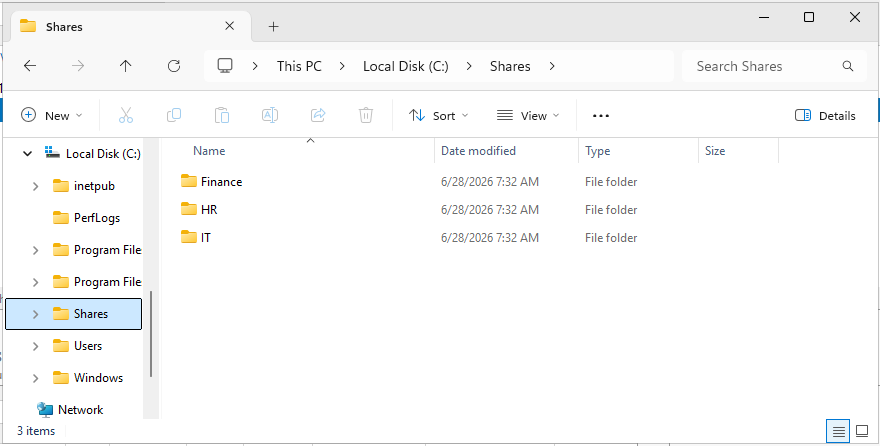
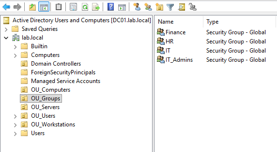
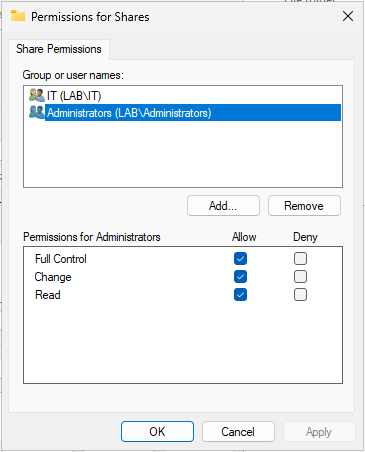
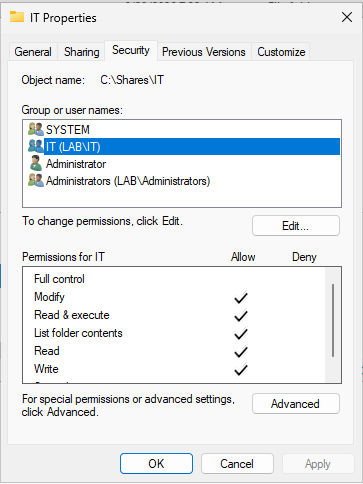
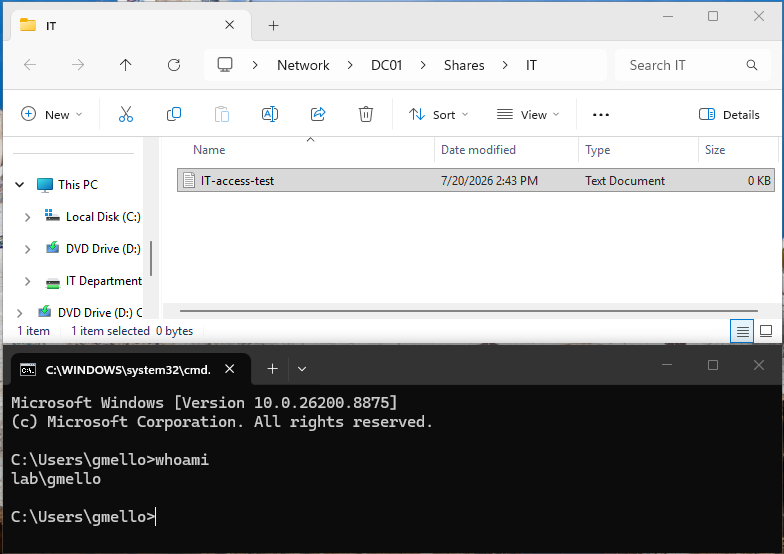
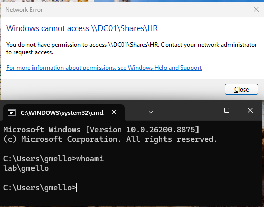
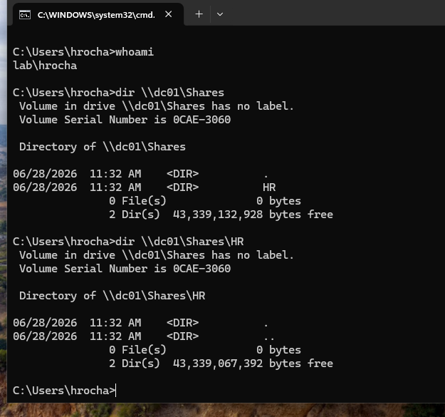
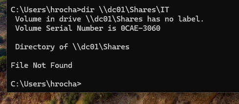

# 02 - File Server and Permissions

**Status:** Completed  
**Domain:** `lab.local`  
**Server:** `DC01`  
**Share path:** `\\DC01\Shares`

## Overview

This project documents the deployment of a centralized Windows file server inside the `lab.local` domain.

A shared parent folder was created on `DC01`, containing separate departmental folders for IT, HR, and Finance. Access was controlled using Active Directory security groups, share permissions, and NTFS permissions.

The objective was to ensure that users could access only the resources assigned to their department while administrators retained full control.

---

## Lab Environment

| Machine | Operating System | IP Address | Purpose |
|---|---|---:|---|
| DC01 | Windows Server 2025 | `192.168.222.20` | Domain Controller, DNS Server, and File Server |
| WIN11-01 | Windows 11 Pro | `192.168.222.30` | Domain-joined workstation used for access testing |

The file server was hosted on the existing domain controller to reduce virtual-machine resource usage in the home lab.

---

## Objectives

- Create a centralized shared-folder structure.
- Create departmental folders for IT, HR, and Finance.
- Use Active Directory security groups to manage access.
- Configure share-level permissions on the parent share.
- Configure NTFS permissions on each department folder.
- Validate authorized access with domain users.
- Validate denied access to unauthorized folders.
- Confirm read and write permissions from the client workstation.

---

## Folder Structure

The following folder structure was created on `DC01`:

```text
C:\Shares
├── Finance
├── HR
└── IT
```

The parent folder was shared as:

```text
\\DC01\Shares
```

Users access their departmental folders through paths such as:

```text
\\DC01\Shares\IT
\\DC01\Shares\HR
\\DC01\Shares\Finance
```



---

## Security Groups

The following Active Directory security groups were used:

- `IT`
- `HR`
- `Finance`
- `IT_Admins`

Users were assigned to groups based on their department:

```text
gmello  → IT
hrocha  → HR
fnunes  → Finance
```

Using groups instead of assigning permissions directly to individual users makes the environment easier to administer and scale.



---

## Permission Design

Windows file access is controlled by two permission layers:

```text
Share permissions
        +
NTFS permissions
        =
Effective access
```

A user must be allowed by both layers to access a folder.

### Share permissions

The parent folder `C:\Shares` was shared as `\\DC01\Shares`.

The share permissions were configured as:

```text
Authenticated Users → Change, Read
Administrators      → Full Control
```

This allows authenticated domain users to reach the shared location while NTFS permissions provide the department-specific restrictions.



### NTFS permissions

Each departmental folder was configured with its corresponding Active Directory group.

For the IT folder:

```text
C:\Shares\IT
```

The `LAB\IT` group was granted:

- Modify
- Read and execute
- List folder contents
- Read
- Write

Administrators and SYSTEM retained administrative access.



The same permission model was applied to the other folders:

```text
C:\Shares\HR      → LAB\HR
C:\Shares\Finance → LAB\Finance
```

---

## Validation with the IT User

The user `gmello` was signed in on `WIN11-01`.

The following command confirmed the authenticated identity:

```cmd
whoami
```

Result:

```text
lab\gmello
```

The user successfully opened:

```text
\\DC01\Shares\IT
```

A test file named `IT-access-test.txt` was created inside the IT folder, confirming read and write access.



The same user was denied access to:

```text
\\DC01\Shares\HR
```

This confirmed that the departmental restrictions were working correctly.



---

## Validation with the HR User

A second user named `hrocha` was created and added to the `LAB\HR` security group.

The authenticated identity was confirmed with:

```cmd
whoami
```

Result:

```text
lab\hrocha
```

The user successfully accessed:

```text
\\DC01\Shares
\\DC01\Shares\HR
```

The root share displayed only the HR folder for the user.



When the user attempted to access:

```text
\\DC01\Shares\IT
```

the folder was hidden and the command returned:

```text
File Not Found
```

This confirmed that unauthorized folders were not visible to the HR user.



---

## Troubleshooting

### HR user could not access the HR folder

Initially, the `hrocha` user was correctly assigned to the `LAB\HR` group but could not access:

```text
\\DC01\Shares\HR
```

The group membership was verified with:

```cmd
whoami /groups | findstr /i "HR"
```

The command confirmed that `LAB\HR` was present in the user's security token.

The issue was caused by restrictive permissions on the parent share and parent NTFS folder.

### Resolution

The parent share permissions were changed to:

```text
Authenticated Users → Change, Read
Administrators      → Full Control
```

The parent folder was also configured to allow authenticated users to traverse and list the shared root, while the departmental folders retained separate NTFS permissions.

After signing out and signing back in, the HR user could access the HR folder but not the IT folder.

### UNC paths in Command Prompt

Typing a UNC path directly into Command Prompt does not navigate to the folder:

```cmd
\\DC01\Shares\IT
```

The following commands were used for testing instead:

```cmd
dir \\DC01\Shares\IT
explorer \\DC01\Shares\IT
pushd \\DC01\Shares\IT
```

---

## Lessons Learned

- Share permissions and NTFS permissions are separate layers.
- Effective access is determined by the most restrictive combination of both layers.
- Security groups should be used instead of assigning permissions directly to individual users.
- A shared parent folder can use broad share permissions while NTFS permissions control access to each department.
- Group membership should be verified from the client using `whoami /groups`.
- Users may need to sign out and sign back in after group-membership changes.
- Access should be tested with both authorized and unauthorized users.
- Successful folder access does not automatically prove write access, so test files should be created when validating permissions.

---

## Skills Demonstrated

- Windows Server file sharing
- SMB share configuration
- Share-permission administration
- NTFS-permission administration
- Active Directory group-based access control
- Departmental folder design
- Windows domain-user testing
- UNC path usage
- Command-line permission validation
- Troubleshooting effective permissions
- Technical documentation

---

## Next Project

The next stage of the lab is Group Policy administration.

The project covers:

- Centralized user and computer configuration
- Control Panel restrictions
- Network-drive mapping
- Group Policy targeting
- Policy validation from the Windows client

See: [03 - Group Policy](../03-group-policy/README.md)