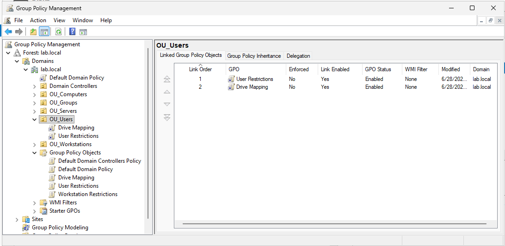
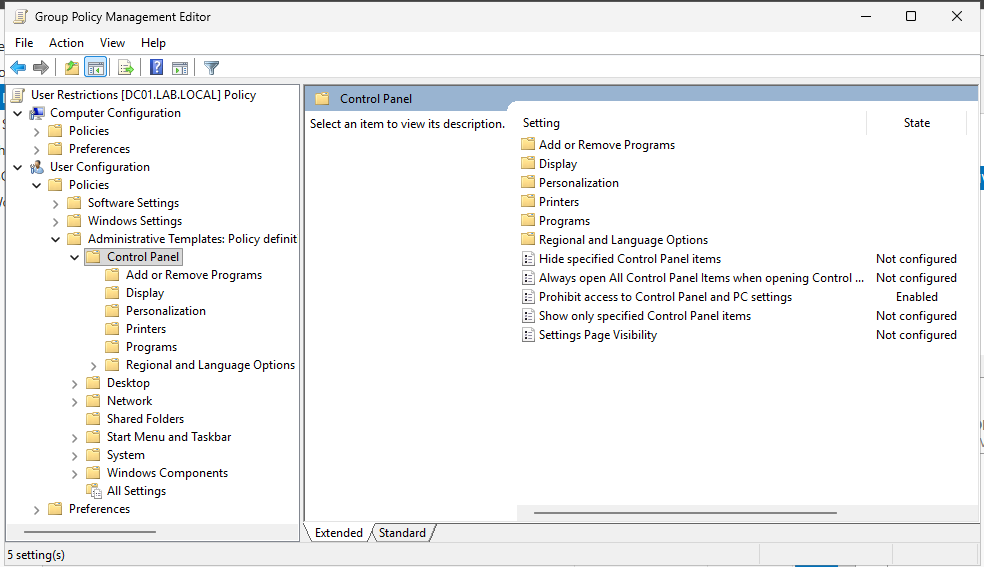
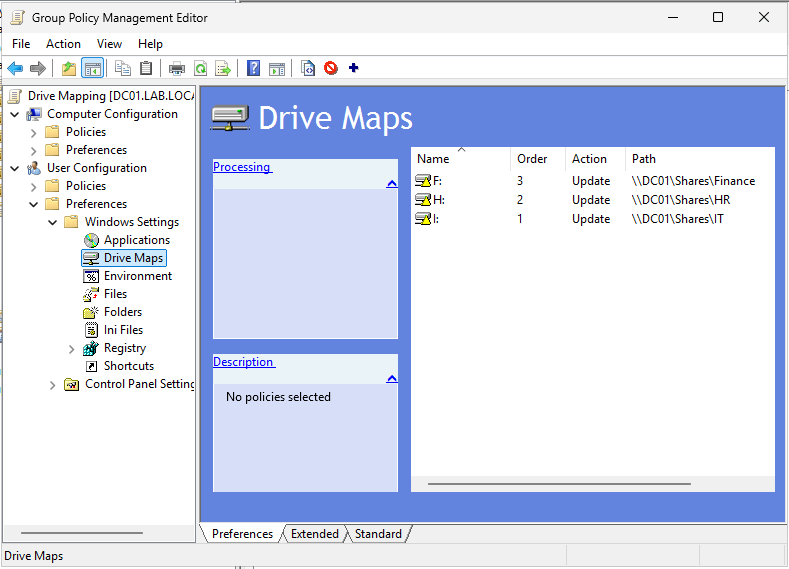
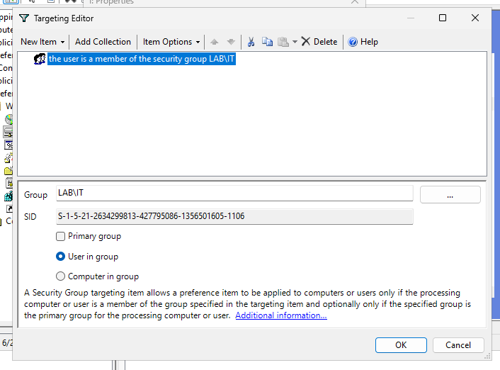
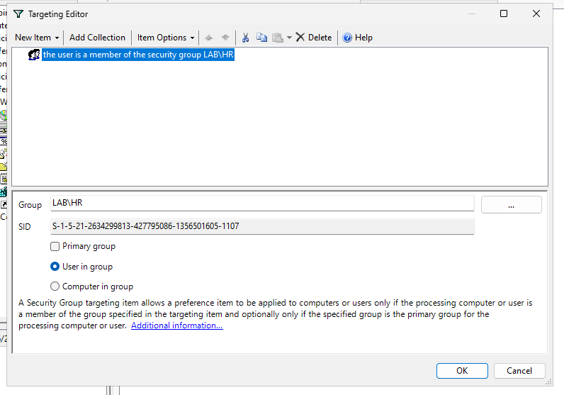
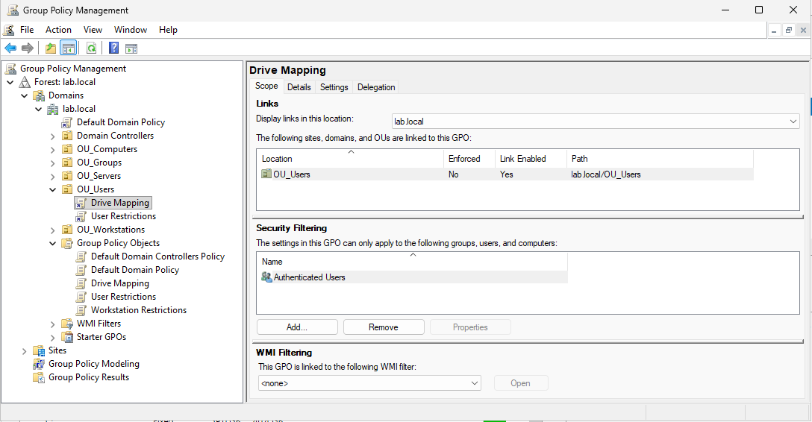
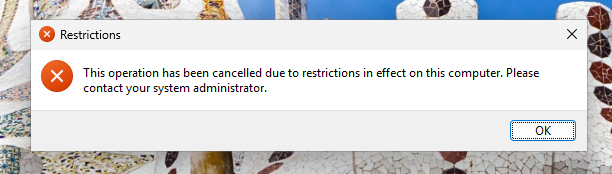
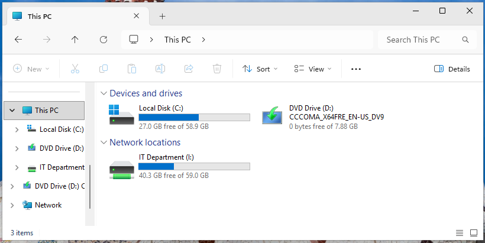
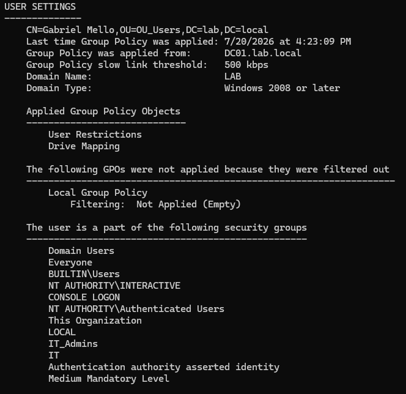

# 03 - Group Policy Administration

**Status:** Completed  
**Domain:** `lab.local`  
**Server:** `DC01`  
**Client:** `WIN11-01`

## Overview

This project documents the implementation of centralized user configuration using Group Policy in the `lab.local` domain.

Two Group Policy Objects were created and linked to `OU_Users`:

- `User Restrictions`
- `Drive Mapping`

The first GPO restricts access to Control Panel and Windows Settings. The second maps departmental network drives automatically according to the user’s Active Directory security-group membership.

The configuration was validated from the Windows 11 client using the `gmello` domain account.

---

## Lab Environment

| Machine | Operating System | IP Address | Purpose |
|---|---|---:|---|
| DC01 | Windows Server 2025 | `192.168.222.20` | Domain Controller, DNS Server, File Server, and Group Policy management |
| WIN11-01 | Windows 11 Pro | `192.168.222.30` | Domain-joined workstation used for policy validation |

The Group Policy Objects were created and managed through the Group Policy Management Console on `DC01`.

---

## Objectives

- Create separate Group Policy Objects for restrictions and drive mapping.
- Link user-based GPOs to `OU_Users`.
- Block access to Control Panel and Windows Settings.
- Automatically map departmental network drives.
- Use item-level targeting to apply drive mappings by security-group membership.
- Force Group Policy updates from the client.
- Validate applied policies with `gpresult`.
- Confirm that policies affect the correct domain user.

---

## Group Policy Structure

The following custom Group Policy Objects were created:

```text
Group Policy Objects
├── Drive Mapping
├── User Restrictions
└── Workstation Restrictions
```

The `Drive Mapping` and `User Restrictions` GPOs were linked to:

```text
lab.local
└── OU_Users
```

This allows the user-based policies to apply to domain users stored inside `OU_Users`.



---

## User Restrictions GPO

The `User Restrictions` GPO was created to centrally restrict access to administrative settings.

The configured policy path was:

```text
User Configuration
└── Policies
    └── Administrative Templates
        └── Control Panel
```

The following setting was enabled:

```text
Prohibit access to Control Panel and PC settings
```

Because this is a user-configuration policy, it follows the user account when the user signs in to an affected domain workstation.



---

## Drive Mapping GPO

The `Drive Mapping` GPO was configured through Group Policy Preferences.

The configuration path was:

```text
User Configuration
└── Preferences
    └── Windows Settings
        └── Drive Maps
```

Three departmental drives were configured:

| Drive | Label | Network path | Action |
|---|---|---|---|
| `F:` | Finance | `\\DC01\Shares\Finance` | Update |
| `H:` | HR | `\\DC01\Shares\HR` | Update |
| `I:` | IT Department | `\\DC01\Shares\IT` | Update |

The **Update** action allows Group Policy to create the drive when it does not exist and update its configuration when necessary.

The **Reconnect** option was enabled so that the drive remains available after future sign-ins.



---

## Item-Level Targeting

Although all three mappings exist in the same GPO, item-level targeting ensures that each user receives only the drive associated with their department.

### IT drive targeting

The `I:` drive mapping was targeted to users who are members of:

```text
LAB\IT
```

This means the IT drive is processed only when the signed-in user belongs to the IT security group.



### HR drive targeting

The `H:` drive mapping was targeted to users who are members of:

```text
LAB\HR
```

This means the HR drive is processed only for members of the HR security group.



The same targeting model was used for the Finance drive with the `LAB\Finance` security group.

---

## GPO Scope and Linking

The `Drive Mapping` and `User Restrictions` GPOs were linked to `OU_Users`.

Both links were enabled, allowing the policies to apply to users stored in that OU.

The GPOs were not enforced, and no WMI filter was required.

Security filtering remained set to:

```text
Authenticated Users
```

The departmental separation for mapped drives was handled through item-level targeting inside the Drive Mapping GPO.



---

## Client-Side Policy Update

On `WIN11-01`, the policies were refreshed using:

```cmd
gpupdate /force
```

After the update completed, the user signed out and signed back in so that all user-based policies and drive mappings could be applied correctly.

---

## Validation: Control Panel Restriction

The `gmello` domain account attempted to open Control Panel on `WIN11-01`.

Windows displayed the following restriction message:

```text
This operation has been cancelled due to restrictions in effect on this computer.
Please contact your system administrator.
```

This confirmed that the `User Restrictions` GPO was successfully applied.



---

## Validation: Department Drive Mapping

The `gmello` user belongs to the `LAB\IT` security group.

After Group Policy processing, the following mapped drive appeared under **This PC**:

```text
IT Department (I:)
```

The drive points to:

```text
\\DC01\Shares\IT
```

The HR and Finance drives were not mapped for this user because the item-level targeting conditions were not met.



---

## Validation with gpresult

The applied user policies were verified using:

```cmd
gpresult /scope user /r
```

The output listed the following under **Applied Group Policy Objects**:

```text
User Restrictions
Drive Mapping
```

The same output also confirmed that the user was a member of:

```text
LAB\IT
```

This validated both the GPO application and the security-group condition used by item-level targeting.



---

## Troubleshooting and Important Observations

### Drive Maps appeared empty in the wrong GPO

When the Drive Maps section was opened inside the `User Restrictions` GPO, no drive-mapping items were displayed.

This occurred because the drive mappings were stored in a separate GPO named:

```text
Drive Mapping
```

Keeping restrictions and drive mappings in separate GPOs makes the environment easier to understand and troubleshoot.

### User policies may require a new sign-in session

Running:

```cmd
gpupdate /force
```

refreshes Group Policy, but some user settings may not fully apply until the user signs out and signs back in.

This was especially relevant for:

- Control Panel restrictions
- Group-membership changes
- Drive mappings
- Item-level targeting

### Security filtering and item-level targeting have different purposes

The GPO remained available to authenticated users through security filtering.

The specific departmental mappings were then controlled through item-level targeting:

```text
LAB\IT      → I:
LAB\HR      → H:
LAB\Finance → F:
```

This allows one GPO to contain several related drive mappings while still applying each item selectively.

---

## Lessons Learned

- Group Policy provides centralized configuration for domain users and computers.
- User Configuration policies follow the user account rather than a specific workstation.
- Separate GPOs make policies easier to manage and troubleshoot.
- Group Policy Preferences can create and maintain mapped network drives.
- Item-level targeting allows individual preference items to apply only when specific conditions are met.
- Security-group membership can be used to assign departmental resources automatically.
- `gpupdate /force` refreshes policies, but a sign-out may still be required.
- `gpresult` is an important tool for confirming which GPOs were actually applied.
- A visible configuration in Group Policy Management should always be validated from the client.

---

## Skills Demonstrated

- Group Policy Management Console administration
- Group Policy Object creation
- GPO linking and scope management
- User Configuration policies
- Administrative Template configuration
- Group Policy Preferences
- Network-drive mapping
- Item-level targeting
- Active Directory group-based policy assignment
- `gpupdate` usage
- `gpresult` validation
- Client-side troubleshooting
- Technical documentation

---

## Next Project

The next stage of the lab is DNS administration.

The project covers:

- Forward Lookup Zones
- A records
- CNAME records
- Reverse Lookup Zones
- PTR records
- DNS cache
- `nslookup`
- DNS troubleshooting and validation

See: [04 - DNS](../04-dns/README.md)