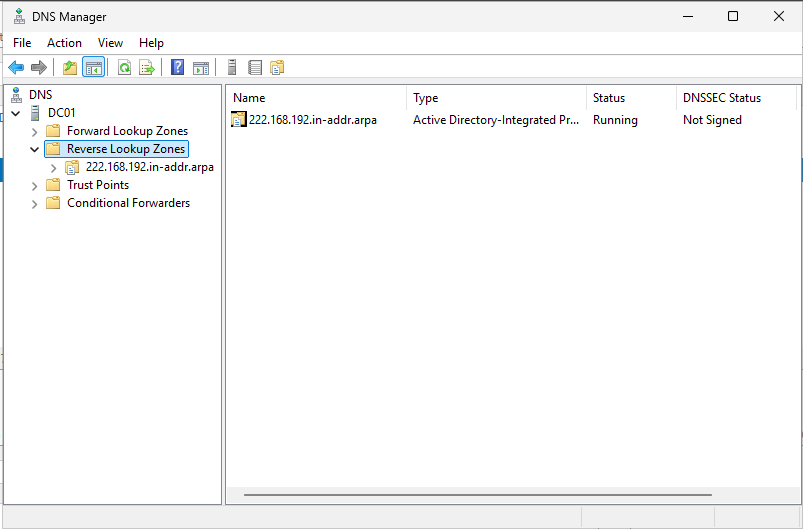
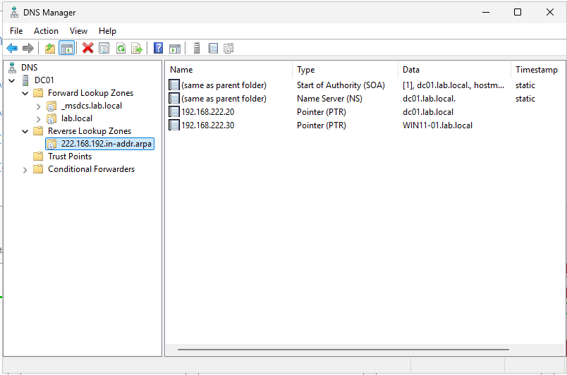
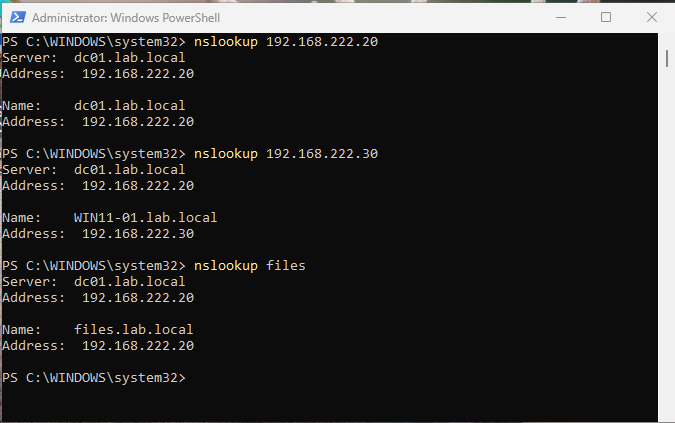

# DNS Configuration

This section documents the DNS configuration completed in the `lab.local` Active Directory environment.

The DNS role is installed on the domain controller, **DC01**, and provides name resolution for the lab network.

## Environment

| System | Operating System | IP Address | Role |
|---|---|---:|---|
| DC01 | Windows Server 2025 | 192.168.222.20 | Domain Controller and DNS Server |
| WIN11-01 | Windows 11 Pro | 192.168.222.30 | Domain-joined client |

**Domain:** `lab.local`  
**Network:** `192.168.222.0/24`

---

## Objectives

The objectives of this configuration were to:

- Verify the existing forward lookup zone
- Create an IPv4 reverse lookup zone
- Create PTR records for the server and client
- Verify forward and reverse DNS resolution
- Resolve the `Server: Unknown` result displayed by `nslookup`

---

## Forward Lookup Zone

The `lab.local` forward lookup zone was created when Active Directory Domain Services and DNS were configured on DC01.

The zone contains host records for:

- `DC01.lab.local` → `192.168.222.20`
- `WIN11-01.lab.local` → `192.168.222.30`
- `files.lab.local` → `192.168.222.20`

The `files.lab.local` record provides a friendly DNS name for accessing the file-server resources hosted on DC01.

---

## Reverse Lookup Zone

An IPv4 reverse lookup zone was created for the lab subnet.

The following network ID was used:

```text
192.168.222
```

Windows generated the following reverse lookup zone:

```text
222.168.192.in-addr.arpa
```

The zone was configured as:

- Primary zone
- Active Directory-integrated
- Replicated to DNS servers in the `lab.local` domain
- Secure dynamic updates enabled



---

## PTR Records

Pointer records were created so that IP addresses can resolve back to hostnames.

The following PTR records were configured:

| IP Address | Hostname |
|---|---|
| 192.168.222.20 | DC01.lab.local |
| 192.168.222.30 | WIN11-01.lab.local |

The PTR record for `192.168.222.20` points to `DC01.lab.local` because DC01 is the primary hostname of the server.

Although `files.lab.local` also points to `192.168.222.20`, it is an additional service name rather than the primary hostname.



---

## DNS Verification

Forward and reverse DNS resolution were tested using `nslookup`.

The following commands were used:

```powershell
nslookup 192.168.222.20
nslookup 192.168.222.30
nslookup files
```

The tests confirmed that:

- `192.168.222.20` resolves to `DC01.lab.local`
- `192.168.222.30` resolves to `WIN11-01.lab.local`
- `files.lab.local` resolves to `192.168.222.20`
- `nslookup` identifies the DNS server as `DC01.lab.local`
- The previous `Server: Unknown` result was resolved



---

## Result

The lab now supports both forward and reverse DNS resolution.

Forward lookup converts a hostname into an IP address:

```text
DC01.lab.local → 192.168.222.20
```

Reverse lookup converts an IP address back into a hostname:

```text
192.168.222.20 → DC01.lab.local
```

This configuration improves DNS troubleshooting and allows network tools to correctly identify systems by hostname.