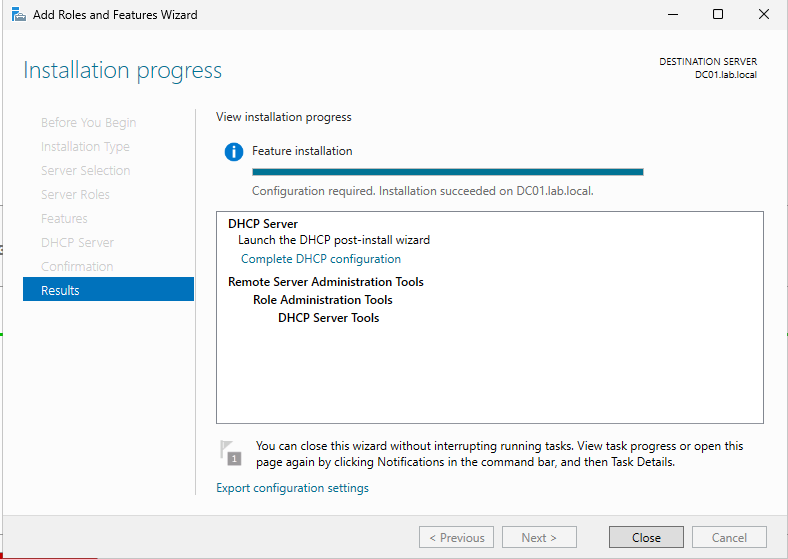
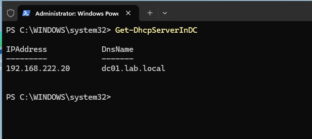
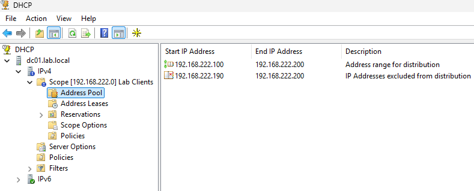
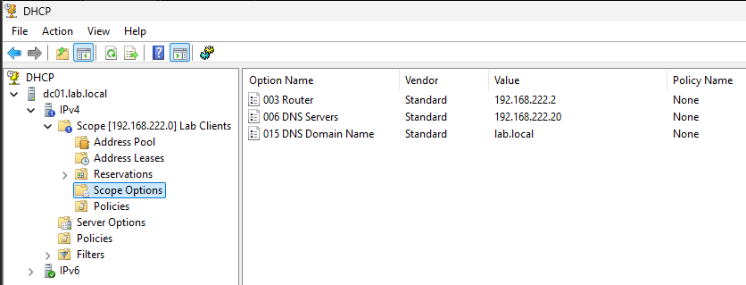
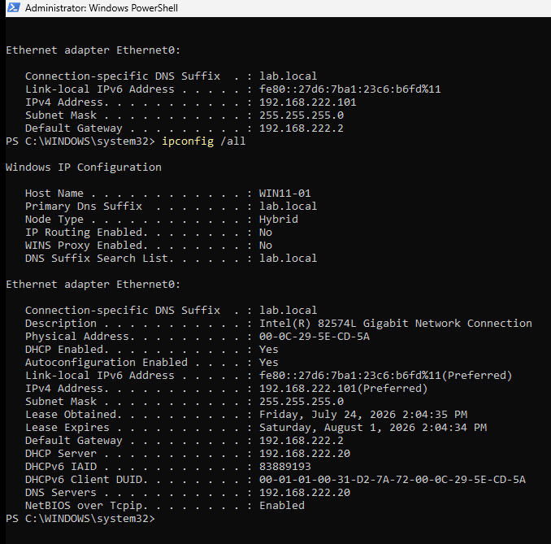
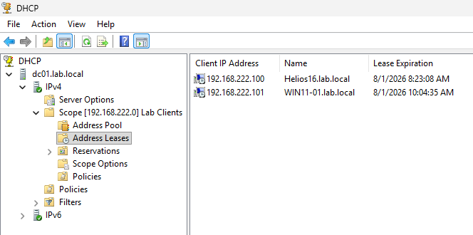

# DHCP Server Configuration

This section documents the installation and configuration of the DHCP Server role in the `lab.local` Active Directory environment.

The DHCP service is hosted on **DC01** and automatically provides network configuration to domain client devices.

## Environment

| System | Operating System | IP Address | Role |
|---|---|---:|---|
| DC01 | Windows Server 2025 | 192.168.222.20 | Domain Controller, DNS Server and DHCP Server |
| WIN11-01 | Windows 11 Pro | Assigned by DHCP | Domain-joined client |

**Domain:** `lab.local`  
**Network:** `192.168.222.0/24`  
**VMware NAT gateway:** `192.168.222.2`

---

## Objectives

The objectives of this configuration were to:

- Install the DHCP Server role on DC01
- Authorize the DHCP server in Active Directory
- Create and activate an IPv4 scope
- Configure the address pool and exclusion range
- Distribute the default gateway, DNS server and DNS suffix
- Change WIN11-01 from static addressing to DHCP
- Verify that the client received a valid lease
- Confirm internal and external DNS resolution

---

## VMware Network Preparation

The lab uses VMware Workstation's `VMnet8` NAT network.

The VMware DHCP service was disabled to prevent two DHCP servers from distributing addresses on the same subnet.

VMware NAT remained enabled so that lab machines could continue accessing external networks through the following gateway:

```text
192.168.222.2
```

After this change, DC01 became the only DHCP server on the `192.168.222.0/24` network.

---

## DHCP Role Installation

The DHCP Server role was installed on DC01 through Server Manager using the Add Roles and Features wizard.



---

## DHCP Authorization

The DHCP security groups were created successfully during post-installation.

The authorization wizard returned error `20079`, indicating that the DHCP server was already present in Active Directory.

Authorization was verified with PowerShell:

```powershell
Get-DhcpServerInDC
```

The result confirmed that `dc01.lab.local` with IP address `192.168.222.20` was authorized to provide DHCP services.



---

## DHCP Scope

An IPv4 scope named `Lab Clients` was created for domain client devices.

The configured address range was:

```text
192.168.222.100 - 192.168.222.200
```

The following exclusion range was added:

```text
192.168.222.190 - 192.168.222.200
```

The effective distributable range is therefore:

```text
192.168.222.100 - 192.168.222.189
```

The exclusion range reserves addresses for future infrastructure devices such as servers, printers, access points or other network equipment.



---

## Scope Options

The following DHCP scope options were configured:

| Option | Value | Purpose |
|---|---|---|
| 003 Router | 192.168.222.2 | Default gateway for client devices |
| 006 DNS Servers | 192.168.222.20 | Internal DNS server hosted on DC01 |
| 015 DNS Domain Name | lab.local | DNS suffix for the Active Directory domain |

Domain clients use DC01 as their DNS server so that Active Directory records and internal hostnames can be resolved correctly.

Public DNS servers were not assigned directly to clients.



---

## Client DHCP Configuration

WIN11-01 was previously configured with the static IP address:

```text
192.168.222.30
```

Because a Group Policy blocks access to Control Panel and Windows Settings, the network adapter was changed to DHCP through PowerShell.

The following commands were used:

```powershell
Set-NetIPInterface -InterfaceAlias "Ethernet0" -Dhcp Enabled
Set-DnsClientServerAddress -InterfaceAlias "Ethernet0" -ResetServerAddresses
ipconfig /release
ipconfig /renew
ipconfig /all
```

The client received the following configuration:

| Setting | Assigned value |
|---|---|
| IPv4 address | 192.168.222.101 |
| Subnet mask | 255.255.255.0 |
| Default gateway | 192.168.222.2 |
| DHCP server | 192.168.222.20 |
| DNS server | 192.168.222.20 |
| DNS suffix | lab.local |



---

## DHCP Lease Verification

The DHCP console on DC01 showed an active lease for WIN11-01.

The address `192.168.222.101` was assigned from the `Lab Clients` scope and associated with the client device.



---

## Connectivity and DNS Tests

The following commands were used from WIN11-01:

```powershell
ping dc01
ping files
nslookup dc01
nslookup files
nslookup google.com
```

The tests confirmed that:

- WIN11-01 could reach DC01
- `dc01.lab.local` resolved correctly
- `files.lab.local` resolved correctly
- External DNS resolution worked
- Internet access remained available through the VMware NAT gateway
- DHCP correctly distributed the gateway, DNS server and domain suffix

---

## Result

DC01 now provides centralized DHCP services for the `lab.local` environment.

The DHCP server automatically distributes:

```text
IP address
Subnet mask
Default gateway
DNS server
DNS domain suffix
```

This eliminates the need to manually configure network settings on each client and creates a more realistic Active Directory infrastructure environment.