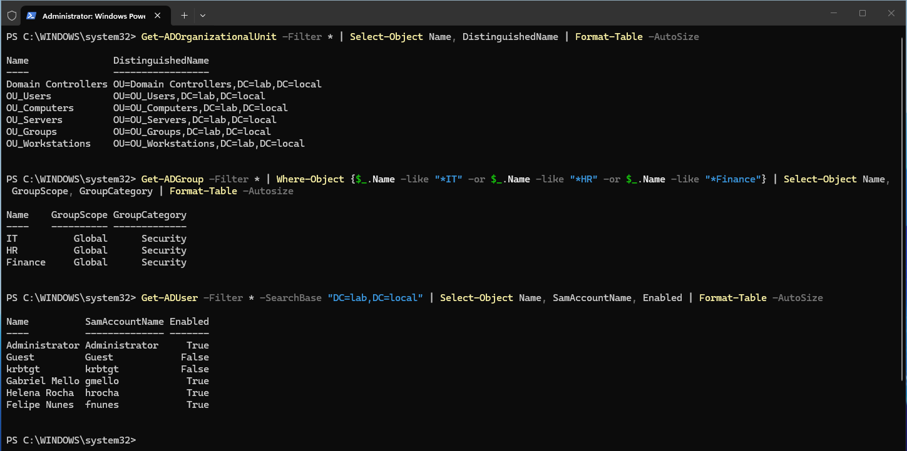
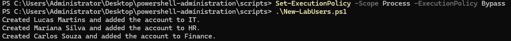
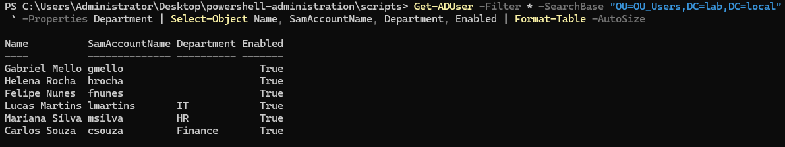
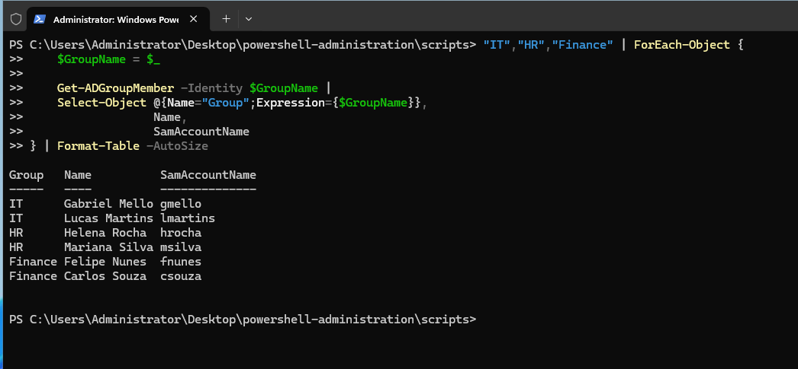
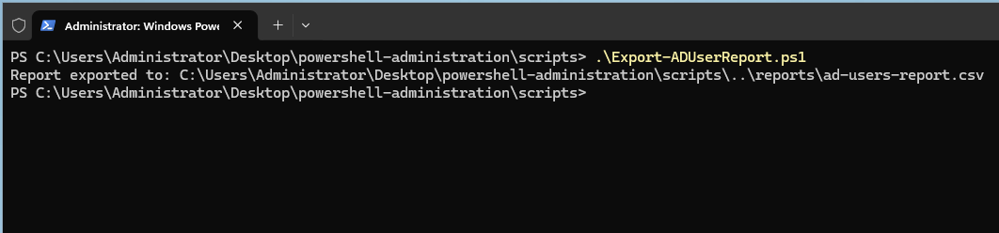
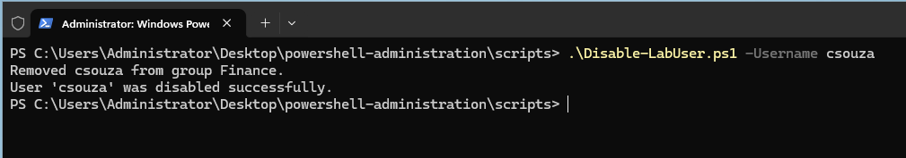
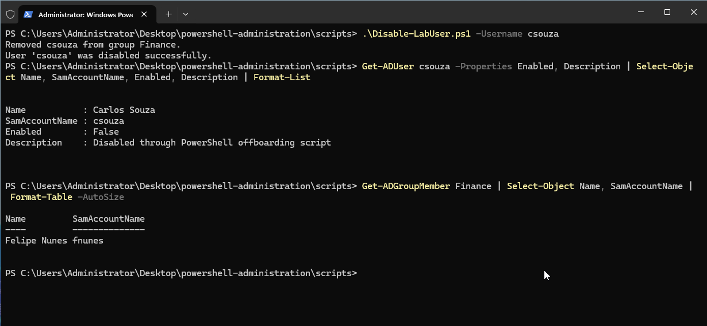
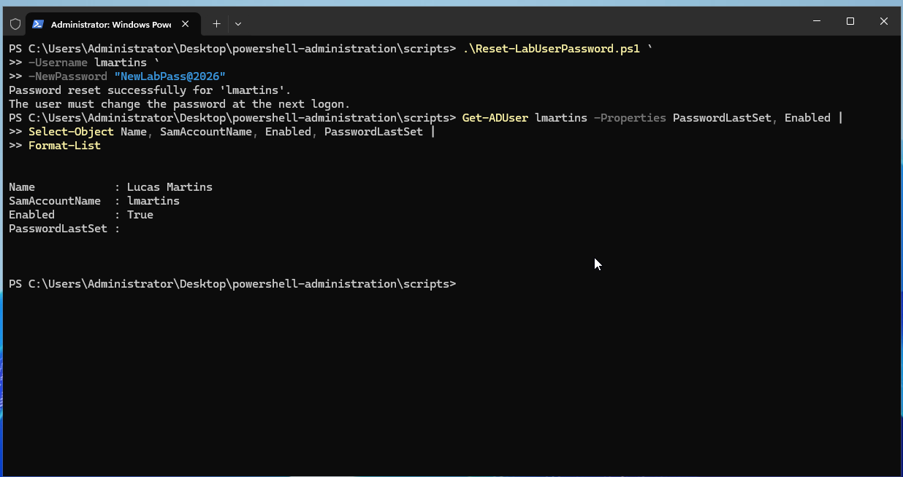

# PowerShell Active Directory Administration

This section documents the use of PowerShell to automate common Active Directory administration tasks in the `lab.local` environment.

The project covers user provisioning, security-group membership, reporting, offboarding and password resets.

## Environment

| System | Operating System | Role |
|---|---|---|
| DC01 | Windows Server 2025 | Domain Controller, DNS and DHCP Server |
| WIN11-01 | Windows 11 Pro | Domain-joined client |

**Domain:** `lab.local`  
**Domain controller:** `DC01.lab.local`  
**Active Directory user OU:** `OU=OU_Users,DC=lab,DC=local`

---

## Objectives

The objectives of this project were to:

- Inspect the existing Active Directory structure with PowerShell
- Import user information from a CSV file
- Create multiple Active Directory users automatically
- Add users to department security groups
- Prevent duplicate user creation
- Export an Active Directory user report
- Automate basic employee offboarding
- Reset user passwords through PowerShell
- Require users to change their passwords at the next logon

---

## Existing Active Directory Structure

Before creating the automation scripts, the existing organizational units, security groups and users were inspected.

The following commands were used:

```powershell
Get-ADOrganizationalUnit -Filter * |
Select-Object Name, DistinguishedName |
Format-Table -AutoSize
```

```powershell
Get-ADGroup -Filter * |
Where-Object {
    $_.Name -like "*IT*" -or
    $_.Name -like "*HR*" -or
    $_.Name -like "*Finance*"
} |
Select-Object Name, GroupScope, GroupCategory |
Format-Table -AutoSize
```

```powershell
Get-ADUser -Filter * -SearchBase "DC=lab,DC=local" |
Select-Object Name, SamAccountName, Enabled |
Format-Table -AutoSize
```

The environment contained the following main organizational units:

```text
OU_Users
OU_Computers
OU_Servers
OU_Groups
OU_Workstations
```

The following department security groups already existed:

```text
IT
HR
Finance
```



---

## Bulk User Provisioning

A CSV file named `users.csv` was created to provide the user information required by the provisioning script.

Example structure:

```csv
FirstName,LastName,Username,Department,Password
Lucas,Martins,lmartins,IT,LabUser@2026
Mariana,Silva,msilva,HR,LabUser@2026
Carlos,Souza,csouza,Finance,LabUser@2026
```

> The accounts and passwords used in this project are fictional and exist only inside the isolated lab environment. Production passwords should not be stored in plain-text CSV files or committed to a public repository.

The `New-LabUsers.ps1` script performs the following actions:

- Imports user information from the CSV file
- Checks whether each username already exists
- Creates the user inside `OU_Users`
- Sets the display name and User Principal Name
- Assigns the department attribute
- Enables the account
- Adds the account to the appropriate department group
- Requires a password change at the first logon
- Skips accounts that already exist

The script was executed with:

```powershell
Set-ExecutionPolicy -Scope Process -ExecutionPolicy Bypass
.\New-LabUsers.ps1
```

The three test users were successfully created and added to their department groups.



---

## User Creation Verification

The new accounts were verified with:

```powershell
Get-ADUser -Filter * `
    -SearchBase "OU=OU_Users,DC=lab,DC=local" `
    -Properties Department |
Select-Object Name, SamAccountName, Department, Enabled |
Format-Table -AutoSize
```

The verification confirmed that:

- `lmartins` was created in the IT department
- `msilva` was created in the HR department
- `csouza` was created in the Finance department
- All three accounts were enabled



---

## Department Group Membership

Group membership was verified with PowerShell:

```powershell
"IT","HR","Finance" | ForEach-Object {
    $GroupName = $_

    Get-ADGroupMember -Identity $GroupName |
    Select-Object `
        @{Name="Group";Expression={$GroupName}},
        Name,
        SamAccountName
} |
Format-Table -AutoSize
```

The output confirmed that each new user was added to the correct security group.



---

## Active Directory User Report

The `Export-ADUserReport.ps1` script was created to generate a CSV report of the accounts inside `OU_Users`.

The report includes:

- Display name
- SAM account name
- Department
- Account status
- Account creation date

The script automatically creates the `reports` folder when it does not already exist.

It was executed with:

```powershell
.\Export-ADUserReport.ps1
```

The exported report was verified with:

```powershell
Import-Csv "..\reports\ad-users-report.csv" |
Format-Table -AutoSize
```



---

## User Offboarding

The `Disable-LabUser.ps1` script was created to automate basic account offboarding.

The script accepts a username as a parameter:

```powershell
.\Disable-LabUser.ps1 -Username csouza
```

It performs the following actions:

- Confirms that the user exists
- Checks whether the account is already disabled
- Removes the user from non-default security groups
- Disables the Active Directory account
- Updates the account description
- Displays the result in the PowerShell console

The fictional Finance user `csouza` was used for the test.

The account was removed from the Finance security group and successfully disabled.



---

## Disabled Account Verification

The disabled account was verified with:

```powershell
Get-ADUser csouza -Properties Enabled, Description |
Select-Object Name, SamAccountName, Enabled, Description |
Format-List
```

Finance group membership was checked with:

```powershell
Get-ADGroupMember Finance |
Select-Object Name, SamAccountName |
Format-Table -AutoSize
```

The results confirmed that:

- The account status was `Enabled: False`
- The description was updated by the offboarding script
- The account was no longer a member of the Finance security group



---

## Password Reset

The `Reset-LabUserPassword.ps1` script was created to perform an administrative password reset.

The script accepts the username and new password as parameters:

```powershell
.\Reset-LabUserPassword.ps1 `
    -Username lmartins `
    -NewPassword "NewLabPass@2026"
```

The script performs the following actions:

- Confirms that the user exists
- Converts the supplied password into a secure string
- Resets the Active Directory password
- Requires a password change at the next logon
- Attempts to unlock the account if it is locked
- Displays a success message

The result was verified with:

```powershell
Get-ADUser lmartins -Properties PasswordLastSet, Enabled |
Select-Object Name, SamAccountName, Enabled, PasswordLastSet |
Format-List
```

A blank `PasswordLastSet` value is expected when Active Directory is configured to require the user to change the password at the next logon.



---

## Scripts

| Script | Purpose |
|---|---|
| `New-LabUsers.ps1` | Creates Active Directory users from a CSV file and adds them to department groups |
| `Export-ADUserReport.ps1` | Exports user account information to a CSV report |
| `Disable-LabUser.ps1` | Removes group memberships and disables an account |
| `Reset-LabUserPassword.ps1` | Resets a password and requires a change at the next logon |

---

## Skills Demonstrated

This project demonstrates practical experience with:

- PowerShell scripting
- Active Directory administration
- CSV-based user provisioning
- Organizational units
- Security-group membership
- User account reporting
- Employee onboarding and offboarding
- Password administration
- Parameterized scripts
- Error handling
- Duplicate-account validation
- Infrastructure documentation

---

## Result

Common Active Directory administration tasks can now be completed through reusable PowerShell scripts rather than manually through graphical management tools.

The project demonstrates how automation can improve consistency, reduce repetitive administrative work and support the management of a larger Windows domain environment.